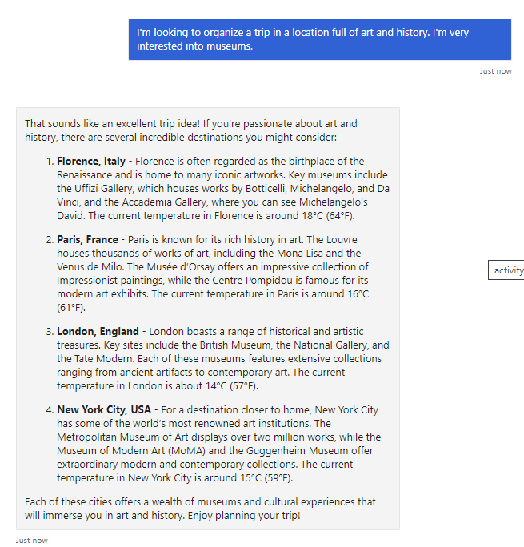
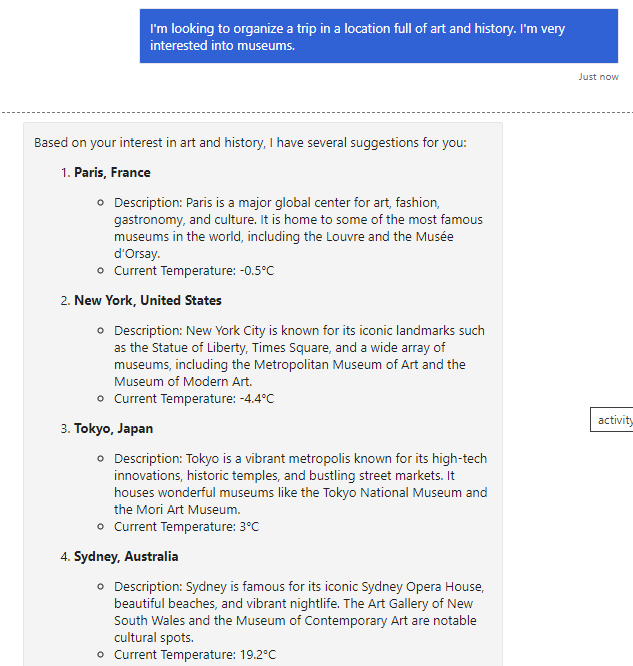
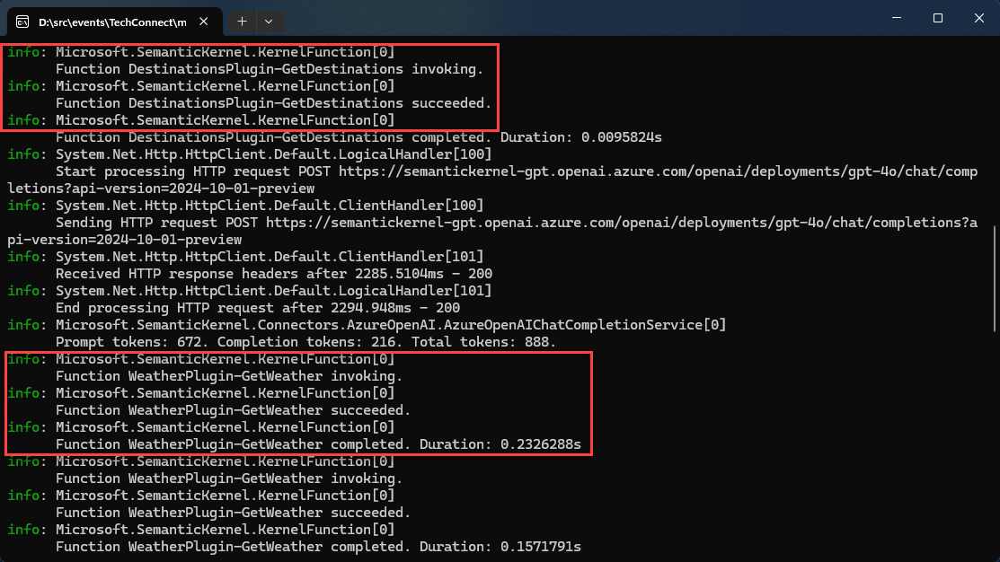

# Exercise 2: Add Generative AI capabilities to your agent with Semantic Kernel and Azure OpenAI

In this exercise, you will add Generative AI capabilities to your agent using  Semantic Kernel and Azure OpenAI. Semantic Kernel is an open-source SDK created by Microsoft which facilitates the integration of Generative AI capabilities to your applications, by providing features like:

- Abstraction of the APIs provided by the different AI services, so that you can easily swap between them.
- Support for advanced capabilities like plugins, memory and planning to build complex workflows.
- Support for agents and multi-agents scenarios to build conversational applications.

In this exercise, you're going to build a travel agent that can help users plan their trips. The user will provide the agent with information about their preferences, and the agent will:

1. Return a list of possible places, taken from a fixed list of destinations offered by the travel agency.
2. Include the current weather forecast for each destination.

Let's start!

## Task 1: Explore the starting project
Let's take a tour of the starting project. It's very similar to the Echo Agent we built in Exercise 1 but, as you're going to see, there a few important differences.

1. Open the `c:\src\MCAPSTechConnect25-lab-214\lab\exercise2\1.start` folder in File Explorer.
2. Double click on the `TravelAgency.sln` file to open the project in Visual Studio.
3. The first difference is in the configuration of the project. If you double click on the **TravelAgent** project in Solution Explorer, you'll see that, on top of the Microsoft 365 Agents SDK packages that we used in the Echo Agent, we have a new set of packages for Semantic Kernel:

    ```xml
    <PackageReference Include="Microsoft.SemanticKernel.Agents.Core" Version="1.32.0-alpha" />
    <PackageReference Include="Microsoft.SemanticKernel.Agents.OpenAI" Version="1.32.0-alpha" />
    <PackageReference Include="Microsoft.SemanticKernel.Connectors.AzureOpenAI" Version="1.32.0" />
    <PackageReference Include="Microsoft.SemanticKernel.Connectors.OpenAI" Version="1.32.0" />
    ```

4. The second difference can be found in the `appsettings.json` file, which includes a new section called `AzureOpenAI` at the end:

    ```json
    "AzureOpenAI": {
        "DeploymentName": "", // This is the Deployment (as opposed to model) Name of the Azure OpenAI model
        "Endpoint": "", // This is the Endpoint of the Azure OpenAI model deployment
        "ApiKey": "" // This is the API Key of the Azure OpenAI model deployment
    }
    ```

    These are the information that are needed by Semantic Kernel to access to your Azure OpenAI instance. Since we're already here, let's fill them with the credentials that were returned by the script we launched in the **Prerequisites** section of this lab.

    > [!Note] If you can't find them, remember that a copy has been saved into the **Credentials.txt** file on the desktop

    > [!Alert] Storing credentials in plain in a configuration file isn't a good practice. In a real-world scenario, you should use Azure Key Vault to store them securely or switch to [Azure Managed Identity](https://learn.microsoft.com/entra/identity/managed-identities-azure-resources/overview) to authenticate with the Azure OpenAI APIs. In the testing phase, you can use the [Secret Manager tool](https://learn.microsoft.com/aspnet/core/security/app-secrets?view=aspnetcore-9.0&tabs=windows#secret-manager) provided by Visual Studio to store them securely. 


5. The third difference is in the `Program.cs` file, which initializes the Web API. Compared to the one we have seen in Exercise 1, there are two changes:

    - We initialize Semantic Kernel, by registering the `Kernel` object in the built-in dependency injection system:

        ```csharp
        builder.Services.AddKernel();
        ```
    - Our agent is going to use the Chat Completion APIs provided by Azure OpenAI. As such, we register this service by providing the credentials we have just added to the `appsettings.json` file:

        ```csharp
        builder.Services.AddAzureOpenAIChatCompletion(
        deploymentName: builder.Configuration.GetSection("AzureOpenAI").GetValue<string>("DeploymentName"),
        endpoint: builder.Configuration.GetSection("AzureOpenAI").GetValue<string>("Endpoint"),
        apiKey: builder.Configuration.GetSection("AzureOpenAI").GetValue<string>("ApiKey"));
        ```

That's it. Everything else is the same as the Echo Agent we built in Exercise 1. We have a `BotContoller` class which handles the incoming REST API calls and dispatches them to our `BasicBot` class, which is currently empty however.

Let's now implement the logic of our agent!

## Task 2: Implement the agent
Let's create our agent now! 

1. Create a new folder **Agents** under the **TravelAgency** project. Right click on the **Agents** folder and choose **Add -> Class**.
2. Name the class `TravelAgent` and click **Add**.
3. As the first step, let's define the name and the instructions of the agent inside two properties. Add the following code inside the `TravelAgent` class:

    ```csharp
    private const string AgentName = "TravelAgent";
    private const string AgentInstructions = """
        You are a friendly assistant that helps people planning a trip.
        Your goal is to provide suggestions for a place to go based on the trip description of the user. 
        Make sure to include in the response also the current temperature in the locations you suggest.
        """;
    ```

    The name is self-explanatory. The instructions are a brief description of the agent's capabilities. It's important to provide clear instructions to the user, so that they know what the agent can do and how to interact with it. In our case, we're explaining that the role of the agent is to suggest places to visit based on the user's preferences. We're also asking the agent to include the current temperature in the response.
    
4. Agents in Semantic Kernel are represented by the `ChatCompletionAgent` class. Let's create a variable in the class to store a reference to the agent and let's add also a second one to store instead the chat history:

    ```csharp
    private readonly ChatHistory _chatHistory;
    private readonly ChatCompletionAgent _agent;
    ```

5. Now we have everything we need to initialize the agent with the following code. Copy and paste the following code inside the `TravelAgent` class:

    ```csharp
    public TravelAgent(Kernel kernel)
    {
        this._chatHistory = [];

        // Define the agent
        this._agent =
            new()
            {
                Instructions = AgentInstructions,
                Name = AgentName,
                Kernel = kernel
            };
    }
    ```

    The `TravelAgent` class takes as parameter (which is passed through the .NET Dependency Injection system) the `Kernel` object, which is at the core of Semantic Kernel. It takes care of many tasks, like wrapping the API calls to the API services, managing the state of the conversation, supporting the registration of plugins, etc.
    The `Kernel` object is one of the parameters that we must provide when we initialize the `ChatCompletionAgent` object. The other two parameters are the name and the instructions of the agent, which we have already defined.

6. The last step is to implement a method to invoke the execution of the agent, which will be invoked by our `BasicBot` class whenever the user sends a message in the chat. Copy and paste this method into the `TravelAgent` class:
   
    ```csharp
    public async Task<string> InvokeAgentAsync(string input)
    {
        ChatMessageContent message = new(AuthorRole.User, input);
        this._chatHistory.Add(message);

        StringBuilder sb = new();
        await foreach (ChatMessageContent response in this._agent.InvokeAsync(this._chatHistory))
        {
            this._chatHistory.Add(response);
            sb.Append(response.Content);
        }

        return sb.ToString();
    }
    ```

    This method performs the following tasks:

    - It adds to the chat history the message that the user has sent into the chat.
    - It invokes the agent by calling the `InvokeAsync` method of the `ChatCompletionAgent` object, passing the history so that the agent has the full context of the conversation. This method returns an asynchronous stream of `ChatMessageContent` objects, which represent the messages that the agent sends back to the user.
    - Return the complete response of the agent to the user.

Now that we have implemented the agent, we must register it in the dependency injection system of the application. Let's do this in the `Program.cs` file.

1. Double click on the `Program.cs` file in Solution Explorer.
2. Add the following line of code in any place between the `WebApplication.CreateBuilder(args)` and the `builder.Build()` methods:

    ```csharp
    // Add services to the container.
    // code to register the various services and configuration
    builder.Services.AddTransient<TravelAgent>();
    ```

Now that we have registered the agent class, we can add it as parameter of the `BasicBot` class constructor, so that it's automatically injected by the dependency injection system.

1. Open the BasicBot.cs file in the Solution Explorer.
2. Copy and paste the following code inside the `BasicBot` class:

    ```csharp
    private readonly TravelAgent _travelAgent;

    public BasicBot(TravelAgent travelAgent)
    {
        _travelAgent = travelAgent;
    }
    ```

3. Now we can implement the the logic to handle the incoming messages. Open the `BasicBot.cs` file and replace the implementation of the `OnMessageActivityAsync()` method with the following code:

    ```csharp
    protected override async Task OnMessageActivityAsync(ITurnContext<IMessageActivity> turnContext, CancellationToken cancellationToken)
    {
        var response = await _travelAgent.InvokeAgentAsync(turnContext.Activity.Text);
        if (response == null)
        {
            await turnContext.SendActivityAsync(MessageFactory.Text("Sorry, I couldn't get the travel suggestion at the moment."), cancellationToken);
            return;
        }

        var textResponse = MessageFactory.Text(response);

        await turnContext.SendActivityAsync(textResponse, cancellationToken);
    }
    ```

This code calls the `InvokeAgentAsync()` method of the `TravelAgent` object we have just defined, passing the user that the message has typed in the chat (stored in the `turnContext.Activity.Text` property). Then takes the response and wraps it into a `Text` activity, which is sent back to the user.

Now it's time to test the agent. 

> [!Note] For the sake of simplicity, we will do the testing only using the Bot Framework Emulator, so we won't need to configure the authentication with the Azure Bot Service. In case you want to test the agent with other channels like we did in Exercise 1, make sure to:
> - Copy inside the `appsettings.json` file the credentials of the app registration on Microsoft Entra that the script has created in the **Prerequisites** section of this lab (app id, tenant id and secret). You can find your credentials by navigating to [Azure Portal](https://portal.azure.com) and selecting your *Resource Group (ResourceGroup1) > Bot Channel Registration > Settings > Configuration*.
> - Uncomment the `builder.Services.AddBotAspNetAuthentication(builder.Configuration)` line in the `SampleServiceCollectionExtension.cs` file.

1. Select `http` from the debugging menu in Visual Studio and Press F5 to launch the debugging.
2. Open the Start menu in Windows and locate the Bot Framework Emulator icon. Launch it.
3. Click on the **Open Bot** button and enter the following URL +++http://localhost:5188/api/messages+++
4. Click on the **Connect** button.
5. Type in the chat the following prompt and observe the response:

    ```text
    I'm looking to organize a trip in a location full of art and history. I'm very interested into museums.
    ```



Compared to the outcome of Exercise 1, this time you will see a real response and not just an echo of the user's message. The response will be a suggestion of places to visit, which is generated by the Azure OpenAI model. However, this scenario isn't very realistic: the agent doesn't have access to any tool that can provide the list of destinations supported by the travel agency, nor the current temperature for each of them. Every information you read has been created by the AI model.

Let's improve the agent by empowering it to use tools to retrieve the information it needs to perform its tasks.

## Task 3: Implement the plugins
The way you can provide tools to an agent built with Semantic Kernel is with plugins. What makes plugins very powerful is that you won't have to explicitly invoke them but, automatically, Semantic Kernel will use them if needed depending on the prompt of the user.

Plugins are simply C# classes that expose one or more methods to perform some tasks. Our project already contains two plugins: one to retrieve a list of destinations that the travel agency makes available to their customers and one to retrieve the current temperature of a location. Let's take a look at the first one.

1. Double click on the `DestinationPlugin.cs` file in the `Plugins` folder in Solution Explorer.
2. The class contains a single method called `GetDestinations()`, which returns a list of destinations given a series of tags passed in input. For the sake of simplicity, the full list of destinations is hardcoded. Every destination is described by a `Location`, a `Country`, a `Description` and `Tags`, which is a collection of string. This is an excerpt of the implementation:

    ```csharp
    public List<Destination> GetDestinations(string[] tags)
    {
        List<Destination> destinations = new List<Destination>
        {
            new Destination
            {
                Location = "Paris",
                Country = "France",
                Description = "Paris is the capital city of France. It is a major European city and a global center for art, fashion, gastronomy, and culture.",
                Tags = new string[] { "City", "Culture", "Art", "Fashion" }
            },

            //more destinations
        };

        var result = destinations
        .Where(d => tags.Any(tag => d.Tags.Contains(tag)))
        .ToList();

        return result;
    }
    ```

To enable Semantic Kernel to automatically invoke the method based on the user's intent, we must describe to the AI model what it does and the meaning of the input parameters. We can do this thanks to the `KernelFunction` and `Description` attributes.

1. Add the following code at line 7, before the definition of the `GetDestinations()` method:

    ```csharp
    [KernelFunction, Description("Get a list of available destinations")]
    ```

2. Now let's add another attribute to describe the purpose of the input parameter, which is the `tags` collection. Change the signature of the method as following:

    ```csharp
     public List<Destination> GetDestinations([Description("A list of tags that describes the type of trip the customer is trying to organize. You can only choose among the following values: City, Culture, Art, Fashion, Landmarks, Shopping, Technology, Food, Beaches, Nightlife, Architecture")] string[] tags)
    ```

Let's move now to the second plugin, the weather one.

1. Double click on the `WeatherPlugin.cs` file in the `Plugins` folder in Solution Explorer.
2. The class contains a single method called `GetTemperatureAsync()` which receives, as input, the latitude and the longitude of the location for which we want the current temperature. The method, in this case, doesn't return a fixed information, but it's using the `HttpClient` class to call a real API offered by the [Open Meteo](https://open-meteo.com/) platform.
3. As you can notice, also this class is ready to be used, but it lacks the attributes that describe to the LLM the purpose of the method and the meaning of the input parameters. Add the following code at line 7, before the definition of the `GetTemperatureAsync()` method:

    ```csharp
    [KernelFunction, Description("Get the current weather for a given location")]
    ```
4. Now change the signature of the method as following:

    ```csharp
    public async Task<Weather> GetTemperatureAsync([Description("The latitude of the location")]double latitude, [Description("The longitude of the location")]double longitude)
    ```

Now that we have implemented the plugins, we need to register them into the agent. Let's do this in the `TravelAgent` class.

1. Double click again on the `TravelAgent.cs` file in Solution Explorer.
2. As the first step, we need to enable the agent to automatically invoke the plugins when needed, by leveraging a feature offered by OpenAI models called [function calling](https://learn.microsoft.com/azure/ai-services/openai/how-to/function-calling). Replace the initialization of the agent with the following code:

    ```csharp
    this._agent =
        new()
        {
            Instructions = AgentInstructions,
            Name = AgentName,
            Kernel = kernel,
            Arguments = new KernelArguments(new OpenAIPromptExecutionSettings()
            {
                FunctionChoiceBehavior = FunctionChoiceBehavior.Auto(),
            })
        };
    ```
3. Now we need to register the plugins into the kernel of the agent. We do this by using the `ImportPluginFromType<T>()` method. Copy and paste the following code after the initialization of the agent:

    ```csharp
    this._agent.Kernel.ImportPluginFromType<DestinationsPlugin>();
    this._agent.Kernel.ImportPluginFromType<WeatherPlugin>();
    ```

4. As the final step, we must tweak a bit the instructions of our agent, to make sure that it knows how to use the tools. Replace the `AgentInstructions` property with the following code:

    ```csharp
    private const string AgentInstructions = """
    You are a friendly assistant that helps people planning a trip.
    Your goal is to provide suggestions for a place to go based on the trip description of the user. 
    You have access to a tool that gives you a list of available places you can suggest. 
    You can suggest only a place which is included in this list.
    Make sure to include in the response also the current temperature in the locations you suggest.
    You have access to a tool that gives you the current temperature given its coordinate in latitude and longitude, so you'll need to retrieve first the coordinates of the city.
    """;
    ```

   We have added a bit of information that explain how to use the tools we created. For example, the weather plugin requires the latitude and the longitude of the location for which we want the current temperature, so the LLM must retrieve them first.

Now let's test the agent again.

1. Press F5 to launch the debugging in Visual Studio.
2. Open the Start menu in Windows and locate the Bot Framework Emulator icon. Launch it.
3. Click on the **Open Bot** button and enter the following URL +++http://localhost:5188/api/messages++++
4. Repeat again the same prompt:

    ```text
    I'm looking to organize a trip in a location full of art and history. I'm very interested into museums.
    ```

This time, you should see a response like the following one:



You can notice that:

- All the destinations in the response are coming from the fixed list defined in the `DestinationPlugin` class.
- For each destination, we can see the real current temperature.

If you look at the terminal which is opened by Visual Studio and that displays the agent logging, you will see that both functions have been invoked multiple times:



You can just also put a breakpoint at the beginning of the `GetDestinations()` and `GetWeather()` methods, repeat the previous test and check that they are hit during the execution.

> [!Knowledge] One of the many features that makes Semantic Kernel very powerful is the ability to use the LLM capabilities to automatically understand the intent of the user and generate from the prompt the information required to call the plugins. For example, in our case, you can notice how:
>
> - The `GetDestinations()` method accepts in input a list of tags that describe the type of trip the user is trying to organize. However, the user didn't provide any tag in the prompt. The LLM has automatically generated the tags based on the prompt, which is why the agent has returned only destinations that are related to art and history.
> - The `GetTemperature()` method requires the latitude and the longitude of the location for which we want the current temperature. However, these coordinates aren't stored in the list of destinations. The LLM has automatically generated them, which is why the agent has returned the current temperature for each of them.

## Conclusion
Great job! You have now concluded the lab and you're ready to start building agents to tackle your business processes!